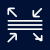

# Containerlab VS Code Extension

The lab-as-code approach taken by Containerlab means labs are "written" in YAML in a text editor or IDE. It also means you have to manage your labs via the command-line.

[VS Code](https://code.visualstudio.com/download) is a powerful text editor used by many for this purpose, and with the YAML schema provided by Containerlab the topology writing experience is made even easier.

We decided to further improve the experience with VS Code with a Containerlab [VS Code extension](https://marketplace.visualstudio.com/items?itemName=srl-labs.vscode-containerlab).

The Containerlab VS Code extension aims to greatly simplify and improve the labbing workflow, allowing you to perform essential lab operations within VS Code.

If you prefer to sit back and watch a video about this extension, say no more!

-{{youtube(url='https://www.youtube.com/embed/NIw1PbfCyQ4')}}-

/// admonition | Support
If you have any questions about this extension, please join us in the [Containerlab Discord](https://discord.gg/vAyddtaEV9).
///

## Features

The Containerlab extension packs a lot of features hidden under the icons or context menus. Here is a list of the main features, and we are always looking for new feature requests:

### Explorer

In the activity bar of VS Code, you will notice a Containerlab icon. Clicking on this icon will open the explorer.

The explorer is similar to the VS Code file explorer but instead of finding files, it discovers Containerlab topologies, running labs, containers and their interfaces.

The explorer will discover all labs in your local directory (and subdirectories), as well as any running labs on the system.

The explorer is a Treeview and for running labs, you can expand the labs to see running containers and you can expand running containers to see their interfaces.

### Editor

In the editor title actions when a Containerlab topology is open, there is a 'run' action and a 'graph' button.

This allows easy deployment and graphing of the lab from within the editor context.


#### Command palette

When you have a topology open and active in the editor you can execute common actions from the command palette that you can open up with `CTRL+SHIFT+P`/`CMD+SHIFT+P`.


#### Keybindings

We have also set some default keybindings you can use to interact with the lab when you are editing a topology.

| Keys         | Action   |
| ------------ | -------- |
| `CTRL+ALT+D` | Deploy   |
| `CTRL+ALT+R` | Redeploy |
| `CTRL+ALT+K` | Destroy  |
| `CTRL+ALT+G` | Graph    |

### Draw.io integration

The [clab-io-draw](https://github.com/srl-labs/clab-io-draw) project unifies two tools, clab2drawio and drawio2clab. These tools facilitate the conversion between Containerlab YAML files and Draw.io diagrams, making it easier for network engineers and architects to visualize, document, and share their network topologies.

### TopoViewer

Integrated as a "graph" action within the extension, the [TopoViewer](https://github.com/asadarafat/topoViewer) project by @asadarafat offers an interactive way to visualize your containerlab topologies.

/// tip
Your lab must be deployed in order to use TopoViewer.
///

#### Label reference

TopoViewer enables customization of the topology visualization by use of the [`labels`](../manual/nodes.md#labels) field in your Containerlab topology definition. By adding these labels you are able to:

- **Customize Icons:** Assign specific icons to nodes based on their role.
- **Organize Nodes:** Group nodes under defined categories with hierarchical levels.
- **Position Nodes Geographically:** Use geographic coordinates (latitude and longitude) to place nodes on a world map.

/// tab | Icon

| Type     | Name         |
| -------- | ------------ |
| `string` | `graph-icon` |

Using the `graph-icon` label you can define a role for a node (or a group of nodes if set under the kind/defaults section). Changing the role will change the icon of the node in the topology visualization.

> When no icon label is defined. The node icon will default to `pe`.

//// details | Available Roles and Icons
    type: subtle-note

| Role/Label name           | Icon                                           |
| ------------------------- | ---------------------------------------------- |
| **`pe`** / **`router`**   |      |
| **`dcgw`**                |        |
| **`leaf`** / **`switch`** |      |
| **`spine`**               |       |
| **`server`**              |      |
| **`pon`**                 |         |
| **`controller`**          |  |
| **`rgw`**                 |         |
| **`client`**              |      |

////
///
/// tab | Group

| Type     | Name          |
| -------- | ------------- |
| `string` | `graph-group` |

Use `graph-group` label to categorize nodes into specific groups such as "Spine", "Leaf", etc.

In the topology visualization this will group all nodes that belong to the group together and draw a box around them.

///
/// tab | Level

| Type                 | Name          |
| -------------------- | ------------- |
| `integer (unsigned)` | `graph-level` |

When you have groups defined, you can use the `graph-level` label to position the nodes hierarchically depending on their level value.

The level value must be a positive integer.

The `graph-level` value is defined in a reverse order, where `1` is the highest level.

<h5>Vertical Layout</h5>

When using the vertical layout algorithm to position nodes, the numerically higher the level value, the lower the group will be positioned relative to other groups.

The group with the level value `1` will be positioned at the top of the visualization.

<h5>Horizontal Layout</h5>

When using the horizontal layout algorithm, the numerically higher the level value, the further left the group will be positioned relative to other groups.

The group with the level value `1` will be positioned furthest to the left.

///
/// tab | Geo coordinates

| Type     | Name                     |
| -------- | ------------------------ |
| `string` | `graph-geoCoordinateLat` |
| `string` | `graph-geoCoordinateLng` |

When using the geo positioning layout algorithm, you should set geographical coordinates in your topology definition so that TopoViewer is aware of where the nodes should be positioned.

If not defined the nodes will be randomly placed on the map.

TopoViewer accepts coordinates in latitude and longitude. Ensure to convert if using other coordinate systems (such as DMS).

`graph-geoCoordinateLat` sets the latitude component of the coordinates.
`graph-geoCoordinateLng` sets the longitude component of the coordinates.

///

#### Sample topology

Below is an example Containerlab topology definition that utilizes these labels to enhance the visualization.

/// tab | Topology visualization


///
/// tab | Topology definition

```{.yaml .code-scroll-lg}
name: nokia-DataCenter-lab

topology:
  nodes:
  
    Spine-01:
      kind: srl
      image: ghcr.io/nokia/srlinux:24.10.2-357-arm64
      labels:
        graph-icon: spine
        graph-group: "Data Center Spine"
        graph-level: 2

    Spine-02:
      kind: srl
      image: ghcr.io/nokia/srlinux:24.10.2-357-arm64
      labels:
        graph-icon: spine
        graph-group: "Data Center Spine"
        graph-level: 2
        graph-geoCoordinateLat: "52.532161628640615"
        graph-geoCoordinateLng: "13.420430194846846"

    Leaf-01:
      kind: srl
      image: ghcr.io/nokia/srlinux:24.10.2-357-arm64
      labels:
        topoViewer-role: server
        graph-group: "Data Center Leaf"
        graph-level: 3
        graph-geoCoordinateLat: "51.45664108633426"
        graph-geoCoordinateLng: "7.00441511803141"

    Leaf-02:
      kind: srl
      image: ghcr.io/nokia/srlinux:24.10.2-357-arm64
      labels:
        topoViewer-role: client
        graph-group: "Data Center Leaf"
        graph-level: 3
        graph-geoCoordinateLat: "51.53871503745607"
        graph-geoCoordinateLng: "7.564717804534128"

    Leaf-03:
      kind: srl
      image: ghcr.io/nokia/srlinux:24.10.2-357-arm64
      labels:
        graph-icon: controller
        graph-group: "Data Center Leaf"
        graph-level: 3
        graph-geoCoordinateLat: "51.326388273344435"
        graph-geoCoordinateLng: "9.49831138932782"

    Leaf-04:
      kind: srl
      image: ghcr.io/nokia/srlinux:24.10.2-357-arm64
      labels:
        topoViewer-role: rgw
        graph-group: "Data Center Leaf"
        graph-level: 3
        graph-geoCoordinateLat: "51.09927769956055"
        graph-geoCoordinateLng: "13.980732881349564"

    BorderLeaf-01:
      kind: srl
      image: ghcr.io/nokia/srlinux:24.10.2-357-arm64
      labels:
        topoViewer-role: switch
        graph-group: "Data Center Border Leaf"
        graph-level: 2
        graph-geoCoordinateLat: "54.318988964885484"
        graph-geoCoordinateLng: "10.190450002066472"

    BorderLeaf-02:
      kind: srl
      image: ghcr.io/nokia/srlinux:24.10.2-357-arm64
      labels:
        topoViewer-role: switch
        graph-group: "Data Center Border Leaf"
        graph-level: 2
        graph-geoCoordinateLat: "54.168316500414994"
        graph-geoCoordinateLng: "12.311934204350786"

    DCGW-01:
      kind: srl
      image: ghcr.io/nokia/srlinux:24.10.2-357-arm64
      labels:
        topoViewer-role: pe
        graph-group: "Data Center DCGW-01"
        graph-level: 1
        graph-geoCoordinateLat: "54.318988964885484"
        graph-geoCoordinateLng: "10.190450002066472"

    DCGW-02:
      kind: srl
      image: ghcr.io/nokia/srlinux:24.10.2-357-arm64
      labels:
        topoViewer-role: router
        graph-group: "Data Center DCGW-02"
        graph-level: 1
        graph-geoCoordinateLat: "54.168316500414994"
        graph-geoCoordinateLng: "12.311934204350786"

  links:

    - endpoints: ["Spine-01:e1-1", "Leaf-01:e1-1"]
    - endpoints: ["Spine-01:e1-2", "Leaf-02:e1-1"]
    - endpoints: ["Spine-01:e1-3", "Leaf-03:e1-3"]
    - endpoints: ["Spine-01:e1-4", "Leaf-04:e1-3"]
    - endpoints: ["Spine-01:e1-5", "BorderLeaf-01:e1-1"]
    - endpoints: ["DCGW-01:e1-1", "BorderLeaf-01:e1-2"]


    - endpoints: ["Spine-02:e1-1", "Leaf-01:e1-2"]
    - endpoints: ["Spine-02:e1-2", "Leaf-02:e1-2"]
    - endpoints: ["Spine-02:e1-3", "Leaf-03:e1-4"]
    - endpoints: ["Spine-02:e1-4", "Leaf-04:e1-4"]
    - endpoints: ["Spine-02:e1-5", "BorderLeaf-02:e1-1"]
    - endpoints: ["DCGW-02:e1-1", "BorderLeaf-02:e1-2"]
```

///

With these enhancements, TopoViewer transforms your Containerlab topology into a clear, intuitive, and manageable network topology.

### Packet capture

In the explorer you can expand running labs and containers to view all the discovered interfaces for that container. You can either right click on the interface and start a packet capture or click the shark icon on the interface label.

Packet capture relies on the [Edgeshark integration](wireshark.md#edgeshark-integration). Install Edgeshark first, and then use the context menu or the fin icon next to the interface name.

#### Integrated Wireshark

If you are unable to install the cshargextcap plugin on your system, or prefer to lab completely inside VS Code then you should take advantage of the integrated Wireshark packet capture.

Edgeshark is still used, but instead the Wireshark window is inside of a container on your Containerlab host, the Wireshark window gets streamed via VNC directly into your VS Code window. When using Remote-SSH, no extra ports are exposed on your host system, everything is tunnelled over the single Remote-SSH connection.

/// admonition | Can I import/export captures
    type: question
Yes, from within Wireshark you may save your captures into the `/pcaps` directory. The capture files will then be found in your [lab directory](./conf-artifacts.md).
///


## Settings reference

Below is a reference to the available settings that can be modified in the Containerlab VS Code extension.

### `containerlab.defaultSshUser`

The default username used to connect to a node via SSH.

| Type     | Default |
| -------- | ------- |
| `string` | `admin` |

### `containerlab.sudoEnabledByDefault`

Whether or not to prepend `sudo` to any commands executed by the extension.

| Type      | Default |
| --------- | ------- |
| `boolean` | `true`  |

### `containerlab.refreshInterval`

The time interval (in milliseconds) for which the extension automatically refreshes.

On each refresh the extension will discover all local and running labs, as well as containers and interfaces of containers belonging to running labs.

By default this is 10 seconds.

| Type     | Default |
| -------- | ------- |
| `number` | `10000` |

### `containerlab.node.execCommandMapping`

The a mapping between the node kind and command executed on the 'node attach' action.

The 'node attach' action performs the `docker exec -it <node> <command>` command. The `execCommandMapping` allows you to change the command executed by default on a per-kind basis.

By default this setting is empty, it should be used to override the [default mappings](https://github.com/srl-labs/vscode-containerlab/blob/main/resources/exec_cmd.json).

| Type     | Default     |
| -------- | ----------- |
| `object` | `undefined` |

#### Example

```json
{
    "nokia_srl": "sr_cli",
}
```

In the settings UI, simply set the 'Item' field to the kind and the 'Value' field to `nokia_srl` and the command to `sr_cli`.

### `containerlab.wsl.wiresharkPath`

The linux path to the Wireshark executable on the Windows System.

The default Wireshark install location on Windows is `C:\Program Files\Wireshark\wireshark.exe`. This maps into a WSL/Linux path of `/mnt/c/Program Files/Wireshark/wireshark.exe`.

| Type     | Default                                        |
| -------- | ---------------------------------------------- |
| `string` | `/mnt/c/Program Files/Wireshark/wireshark.exe` |

### `containerlab.remote.hostname`

An override to set the target hostname or IP address of the system.

This is useful in cases where you need to change the hostname used to initiate packet capture. For example using `127.0.0.1` instead of `localhost`.

| Type     | Default     |
| -------- | ----------- |
| `string` | `undefined` |

### `containerlab.drawioDefaultTheme`

The default theme to be used for the draw.io graph functions. Options are:

- `nokia_modern`
- `nokia`
- `grafana`

| Type     | Default        |
| -------- | -------------- |
| `string` | `nokia_modern` |

### `containerlab.runtime`

Used to set the runtime that containerlab is using in the system. Options are:

- `docker`
- `podman`
- `ignite`

It is not recommended to change this unless you know what you are doing.

| Type     | Default  |
| -------- | -------- |
| `string` | `docker` |

### `containerlab.skipCleanupWarning`

Whether to hide the confirmation message when doing a cleanup operation on your lab.

| Type      | Default |
| --------- | ------- |
| `boolean` | `false` |

### `containerlab.node.telnetPort`

The port to use when using the 'Connect (Telnet)' command. The telnet command is executed inside the container via `docker exec -it <node> telnet 127.0.0.1 <port>`, where `<port>` is the value this setting modifies.

| Type      | Default |
| --------- | ------- |
| `number`  |  `5000` |

### `containerlab.extras.fcli.extraDockerArgs`

Extra arguments to pass to the `docker run` command for fcli.

| Type     | Default     |
| -------- | ----------- |
| `string` | `undefined` |

### `containerlab.capture.preferredAction`

The capture method that should be used for the capture quick action (the shark icon on an interface item in the tree). Options are:

- `Edgeshark`
- `Wireshark VNC`

When the setting is undefined, the default logic will be used to determine whether a `tcpdump` capture + pipe into Wireshark can be used (only when the extension is running in a WSL or Linux environment without using Remote-SSH).

| Type     | Default     |
| -------- | ----------- |
| `string` | `undefined` |

### `containerlab.capture.dockerImage`

Override the docker image used for the integrated Wireshark VNC based capture method.

| Type      | Default                                          |
| --------- | ------------------------------------------------ |
| `string`  |  `ghcr.io/kaelemc/wireshark-vnc-docker:latest`   |

### `containerlab.capture.wireshark.extraDockerArgs`

Extra arguments to pass to the `docker run` command for the integrated Wireshark VNC based capture.

Useful for bind mounts, extra environment variables etc.

| Type     | Default     |
| -------- | ----------- |
| `string` | `undefined` |

### `containerlab.capture.wireshark.theme`

The default theme of the Wireshark application when using the integrated Wireshark VNC based capture. Options are:

- `Follow VS Code theme` (Selects dark or light mode based on your current VS Code theme)
- `Dark`
- `Light`

| Type      | Default                   |
| --------- | ------------------------- |
| `string`  |  `Follow VS Code theme`   |