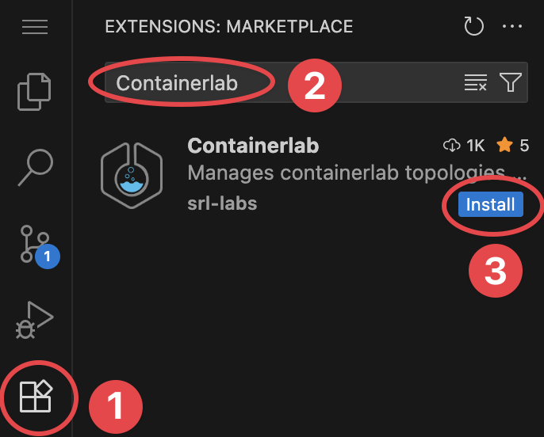
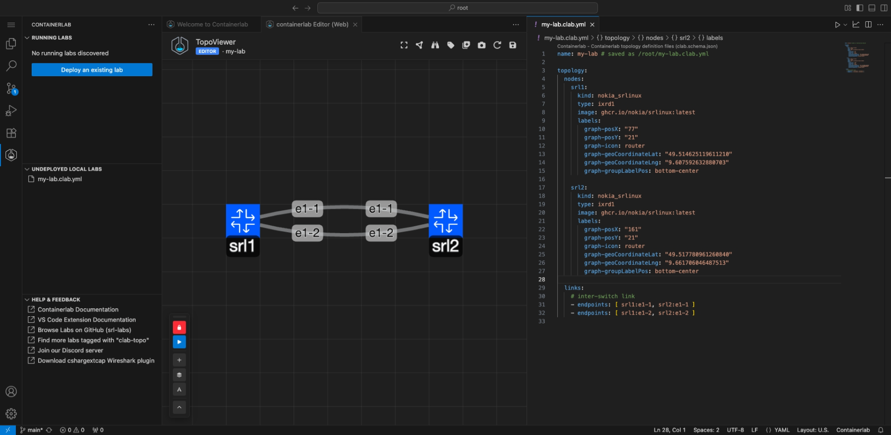

# Containerlab VS Code Extension

The lab-as-code approach taken by Containerlab means labs are "written" in YAML in a text editor or IDE. It also means you have to manage your labs via the command-line.

[VS Code](https://code.visualstudio.com/download) is a powerful text editor used by many for this purpose, and with the YAML schema provided by Containerlab the topology writing experience is made even easier.

We decided to further improve the experience with VS Code with a Containerlab [VS Code extension](https://marketplace.visualstudio.com/items?itemName=srl-labs.vscode-containerlab).

The Containerlab VS Code extension aims to greatly simplify and improve the labbing workflow, allowing you to perform essential lab operations within VS Code.

If you prefer to sit back and watch a video about this extension, say no more!

-{{youtube(url='https://www.youtube.com/embed/NIw1PbfCyQ4')}}-

/// admonition | Support
If you have any questions about this extension, please join us in the [Containerlab Discord](https://discord.gg/vAyddtaEV9).
///

## Installation

If you are running VS Code locally on your laptop you can navigate to the [Marketplace](https://marketplace.visualstudio.com/items?itemName=srl-labs.vscode-containerlab) in your browser, this will provide a prompt to open VS Code to the store extension page.

You can also navigate to the extensions tab inside of VS Code and search for 'Containerlab':



After the installation, you should see a new 'Welcome to Containerlab' page appear.

/// admonition | Containerlab installation
    type: tip
The extension will also detect if Containerlab is installed on your system, if it's not found you will get a prompt in the bottom right to **Install Containerlab**. 

Hit **Install Containerlab**, tada! as easy as that Containerlab (and it's depedencies) are now installed on your system, just freshly connect to your vscode session and you are ready to go.
///

## Connect to Containerlab host

If containerlab runs on a remote machine, you must connect to the lab environment using the Remote SSH functionality in VS Code, as this is where Containerlab is running.

??? tip "How to use Remote SSH"
    

## Features

The Containerlab extension packs a lot of features hidden under the icons or context menus. Here is a list of the main features, and we are always looking for new feature requests:

### Explorer

In the activity bar of VS Code, you will notice a Containerlab icon. Clicking on this icon will open the explorer.

The explorer is similar to the VS Code file explorer but instead of finding files, it discovers Containerlab topologies, running labs, containers and their interfaces.

The explorer will discover all labs in your local directory (and subdirectories), as well as any running labs on the system.

The explorer is a Treeview and for running labs, you can expand the labs to see running containers and you can expand running containers to see their interfaces.


#### Running labs

The running labs panel will display all deployed containerlabs on the system.

You can expand the running lab to view the individual containers which belong to the lab, and interact with them (ie. telnet, SSH, start/stop etc.)

You can expand each container to view it's interfaces, set link impairments and perform packet captures.

#### Undeployed local labs

The undeployed local labs panel will show all discovered topology files in the directory of your current [VS Code Workspace](https://code.visualstudio.com/docs/editor/workspaces)

Topology files are discovered by recursively searching your workspace directory and subdirectories for files which have the `*.clab.yaml` or `*.clab.yml` file extension.

#### Help & Feedback

The aptly named 'Help & Feedback' panel displays shortcuts to documentation pages which can be of help when using Containerlab.

### Editor

In the editor title actions when a Containerlab topology is open, there is a 'run' action and a 'graph' button.

This allows easy deployment and graphing of the lab from within the editor context.


#### Command palette

When you have a topology open and active in the editor you can execute common actions from the command palette that you can open up with `CTRL+SHIFT+P`/`CMD+SHIFT+P`.


#### Keybindings

We have also set some default keybindings you can use to interact with the lab when you are editing a topology.

| Keys         | Action   |
| ------------ | -------- |
| `CTRL+ALT+D` | Deploy   |
| `CTRL+ALT+R` | Redeploy |
| `CTRL+ALT+K` | Destroy  |
| `CTRL+ALT+G` | Graph    |

### TopoViewer

The extension makes it easy to visualize and edit topologies by introducing the TopoViewer tool.

The TopoViewer is a graphical topology creator/editor allowing Containerlab topologies to be created interactively. TopoViewer also is a visualization tool to interact with your running lab topologies.



Launch TopoViewer by clicking on the :material-file-plus-outline: icon; or the 'Create topology with TopoViewer' button.


You will be prompted for a path for where to put the new topology file.


TopoViewer will open with the Containerlab YAML file on one side, and the TopoViewer graphical topology editor on the other.


You can click and drag on nodes to move them around. Add nodes using the :octicons-plus-16: icon, hold right click on a node or a link to open an editor wheel which lets you edit properties of the node/link, or add/remove a node/link.

You can also reposition and lock the position of the floating editor panel. Hover over the icons on the floating panel to see what function each button does.

#### Creating a topology

The default topology consists of 2 SR Linux nodes connected back to back with links on the `e1-1` and `e1-2` interfaces. You can modify this by:

- **Adding nodes**: Click the :octicons-plus-16: icon and click on the canvas
- **Creating links**: Hold right-click on a node to open the radial menu, select the link option, then click on the target node
- **Editing properties**: Right-click on nodes or links to modify their properties
- **Deleting elements**: Use the radial menu to remove nodes or links

#### Deploying the lab

You can deploy the lab using the Deploy (:fontawesome-solid-play:) button on the floating panel in TopoViewer.


Or right click on the lab in the lab explorer and click **Deploy**.


When the lab deployment starts, a small notification will show on the *bottom right* to notify you that the lab is in the process of deploying. You can click the **View Logs** button to open the **Output** panel and watch all logging and backend command execution.

Looking back at the tree view, you should be able to see the icon colour of the lab change to a :green_circle: when the lab is up and running.

#### Interacting with running labs

When the lab is running, TopoViewer switches to viewer mode. The editing functionality is no longer available, and the mode indicator below the TopoViewer text in the navbar says 'Viewer'.

With the lab running, you can expand the lab in the tree view and drill all the way down to per-node interface level. By hovering on the lab, containers or interfaces you can see a small tooltip which displays some key info, such as node name, image, kind, IP address or interface MAC addresses and MTU.


##### Using the tree view

If you hover over the container node in the tree, you should notice on the right side that there are three quick actions for the node:

- :fontawesome-solid-bars: View the container logs - useful to see any bootup or crash information
- :octicons-terminal-16: Connect to the container shell - useful for linux nodes or troubleshooting
- :material-remote-desktop: Connect via SSH to the node - drop into the CLI of the NOS

You can also right-click on the node in the tree view to see all functionality available to interact with a node, for example: to connect via telnet.

/// tip
If you right click on the lab node in the tree, you can SSH to all nodes in your topology using VS Code's integrated multi-tabbed terminal.
///

##### Using TopoViewer

With the context-aware radial menu in TopoViewer viewer mode, you can:

- SSH to the node
- Drop into the node's container shell
- View the node's container logs
- View node properties

#### Enhanced visualization features

TopoViewer includes extra functions to aid in the visualization of your lab topology:

- **Add Groups**: Use the :fontawesome-solid-layer-group: button to organize nodes into logical groups
- **Add Text Labels**: Use the :fontawesome-solid-font: button to add descriptive text to your topology
- **Export to SVG**: Click the :fontawesome-solid-camera: icon in the top right of the TopoViewer navbar to export the canvas to an SVG file

/// tip
The export feature makes it easy to share your topology diagrams with others or include them in documentation.
///

#### TopoViewer keyboard shortcuts

TopoViewer supports keyboard shortcuts and mouse actions for efficient topology management:

/// tab | Viewer Mode

| Action | Shortcut |
| ------ | -------- |
| Select node/link | ++left-button++ |
| Draw selection box | ++shift++ + drag |
| Node actions | ++right-button++ |
| Capture packets | ++right-button++ on link |
| Move nodes | Drag with mouse |

///
/// tab | Editor Mode

| Action | Shortcut |
| ------ | -------- |
| Add node | ++shift+left-button++ |
| Create link | ++shift++ + click source node, then target node |
| Draw selection box | ++shift++ + drag |
| Delete element | ++alt+left-button++ |
| Context menu | ++right-button++ |
| Select all | ++ctrl+a++ / ++cmd+a++ |
| Create group | ++g++ (empty or from selection) |
| Delete selection | ++delete++ |

///
/// tab | Panel Controls

| Action | Shortcut |
| ------ | -------- |
| Close panel | ++escape++ |
| Submit form | ++enter++ |

///

### Inspect Lab

You can inspect the lab in the tabular format you may be used to from the Containerlab CLI. This is a great way to quickly take a look at all information of the lab.

Simply right click on the lab name then click **Inspect Lab**.

There is a search box to aide in filtering if your topology has many nodes.


### Packet capture

In the explorer you can expand running labs and containers to view all the discovered interfaces for that container. You can either right click on the interface and start a packet capture or click the shark icon on the interface label.

The extension provides two packet capture methods:

#### Integrated Wireshark

The integrated Wireshark packet capture (using noVNC) is the default method and requires no additional setup. It's perfect for users who prefer to lab completely inside VS Code or cannot install additional software on their system.

Edgeshark is still used on the Containerlab host, but the Wireshark client with the capture plugin is fully hosted inside of a container on your Containerlab host, the Wireshark window gets streamed via VNC directly into your VS Code window. When using Remote-SSH, no extra ports are exposed on your host system, everything is tunnelled over the single Remote-SSH connection.


/// admonition | Can I import/export captures
    type: question
Yes, from within Wireshark you may save your captures into the `/pcaps` directory. The capture files will then be found in your [lab directory](./conf-artifacts.md).
///

/// admonition | How does this work?
    type: question
Wireshark runs in a Linux container on the Containerlab host. The container has minimal packages ensure the Wireshark GUI is displayed. The Wireshark window is launched and then streamed via VNC into your VS Code window.

When connecting using VS Code remote functionality, the VNC is streamed securely through the VS Code remote tunnel. <u>No extra external ports are opened</u>.
///


This option is perfect for users who occasionally need to capture packets but can not install the Edgeshark capture plugin on their system. An ideal case for managed labs or instructor-led workshops where attendees may not have the necessary permissions to install software.

#### Edgeshark with Local Wireshark

If you prefer to use your local Wireshark installation for packet capture, you can use the [Edgeshark integration](wireshark.md#edgeshark-integration) directly. 

To use this method, you need to [download the cshargextcap plugin](https://github.com/siemens/cshargextcap/releases) for your OS/distribution and install it to your local Wireshark. Once installed, you can change the capture preference in the extension settings from "Wireshark VNC" to "Edgeshark".

### Draw.io integration

You can generate draw.io diagrams from the extension with a few clicks.

Right-click on the lab in the tree view and hover over **Graph Lab (draw.io)**. This will open a submenu where you can choose between:

- Horizontal mode (automatically lay out nodes horizontally - position from left to right).
- Interactive mode (opens a terminal UI to configure the diagram output style).
- Vertical mode (automatically lay out nodes vertically - position top to bottom).

The diagram opens inside a draw.io editor inside VS Code so that you can edit away.


/// admonition | Node arrangement
    type: tip
When arranged the nodes with TopoViewer, the layout (horizontal, vertical) will follow the placement of TopoViewer
///

### Link impairments

In Containerlab you are able to set link impairments for your labs. The impairments are delay, jitter, corruption and packet loss.

The extension simplifies the method of managing these impairments by providing a page to manage all impairments for a nodes' interface(s); or quickly setting an impairment on an interface via the interface element in the running labs tree.

Enter the impairment editor by right clicking on one of the nodes in the tree, and selecting the 'Link impairments' option in the context menu. This will open the impairment editor.


/// admonition | WSL
    type: tip
This feature is only supported on Linux (not WSL)
///

## Settings reference

Below is a reference to the available settings that can be modified in the Containerlab VS Code extension.

/// note
If editing JSON settings directly, please ensure you prepend `containerlab.` to any of the bellow setting paths.

For example: `defaultSshUser` -> `containerlab.defaultSshUser`.
///

### `defaultSshUser`

The default username used to connect to a node via SSH.

| Type     | Default |
| -------- | ------- |
| `string` | `admin` |

### `sudoEnabledByDefault`

Whether or not to prepend `sudo` to any commands executed by the extension.

| Type      | Default |
| --------- | ------- |
| `boolean` | `true`  |

### `refreshInterval`

The time interval (in milliseconds) for which the extension automatically refreshes.

On each refresh the extension will discover all local and running labs, as well as containers and interfaces of containers belonging to running labs.

By default this is 10 seconds.

| Type     | Default |
| -------- | ------- |
| `number` | `10000` |

### `node.execCommandMapping`

The a mapping between the node kind and command executed on the 'node attach' action.

The 'node attach' action performs the `docker exec -it <node> <command>` command. The `execCommandMapping` allows you to change the command executed by default on a per-kind basis.

By default this setting is empty, it should be used to override the [default mappings](https://github.com/srl-labs/vscode-containerlab/blob/main/resources/exec_cmd.json).

| Type     | Default     |
| -------- | ----------- |
| `object` | `undefined` |

#### Example

```json
{
    "nokia_srl": "sr_cli",
}
```

In the settings UI, simply set the 'Item' field to the kind and the 'Value' field to `nokia_srl` and the command to `sr_cli`.

### `node.sshUserMapping`

Custom SSH users for different node kinds. Enter the mapping between the kind and SSH username.

| Type     | Default     |
| -------- | ----------- |
| `object` | `{}`        |

#### Example

```json
{
    "nokia_srlinux": "clab"
}
```

This means that `ssh clab@<container>` will be used if `<container>` is the `nokia_srlinux` kind.

### `remote.hostname`

An override to set the target hostname or IP address of the system.

This is useful in cases where you need to change the hostname used to initiate packet capture. For example using `127.0.0.1` instead of `localhost`.

| Type     | Default     |
| -------- | ----------- |
| `string` | `undefined` |

### `remote.packetflixPort`

Port to use for the packetflix endpoint used for packet capture.

| Type     | Default |
| -------- | ------- |
| `number` | `5001`  |

### `drawioDefaultTheme`

The default theme to be used for the draw.io graph functions. Options are:

- `nokia_modern`
- `nokia`
- `grafana`

| Type     | Default        |
| -------- | -------------- |
| `string` | `nokia_modern` |

### `runtime`

Used to set the runtime that containerlab is using in the system. Options are:

- `docker`
- `podman`
- `ignite`

It is not recommended to change this unless you know what you are doing.

| Type     | Default  |
| -------- | -------- |
| `string` | `docker` |

### `skipCleanupWarning`

Whether to hide the confirmation message when doing a cleanup operation on your lab.

| Type      | Default |
| --------- | ------- |
| `boolean` | `false` |

### `deploy.extraArgs`

Additional command-line options appended to all 'containerlab deploy' and 'containerlab redeploy' commands.

| Type     | Default |
| -------- | ------- |
| `string` | `""`    |

### `destroy.extraArgs`

Additional command-line options appended to all 'containerlab destroy' commands.

| Type     | Default |
| -------- | ------- |
| `string` | `""`    |

### `showWelcomePage`

Show the welcome page when the extension activates.

| Type      | Default |
| --------- | ------- |
| `boolean` | `true`  |

### `node.telnetPort`

The port to use when using the 'Connect (Telnet)' command. The telnet command is executed inside the container via `docker exec -it <node> telnet 127.0.0.1 <port>`, where `<port>` is the value this setting modifies.

| Type      | Default |
| --------- | ------- |
| `number`  |  `5000` |

### `extras.fcli.extraDockerArgs`

Extra arguments to pass to the `docker run` command for fcli.

| Type     | Default     |
| -------- | ----------- |
| `string` | `undefined` |

### `capture.preferredAction`

The capture method that should be used for the capture quick action (the shark icon on an interface item in the tree). Options are:

- `Edgeshark`
- `Wireshark VNC`

| Type     | Default         |
| -------- | --------------- |
| `string` | `Wireshark VNC` |

### `capture.wireshark.dockerImage`

Override the docker image used for the integrated Wireshark VNC based capture method.

| Type      | Default                                          |
| --------- | ------------------------------------------------ |
| `string`  |  `ghcr.io/kaelemc/wireshark-vnc-docker:latest`   |

### `capture.wireshark.pullPolicy`

The pull policy to use for the integrated Wireshark VNC docker image. Options are:

- `always`
- `missing`
- `never`

This setting should be used if a custom docker image is being used. Refer to the [docker documentation.](https://docs.docker.com/reference/cli/docker/container/run/#pull)

| Type     | Default     |
| -------- | ----------- |
| `string` | `always`    |

### `capture.wireshark.extraDockerArgs`

Extra arguments to pass to the `docker run` command for the integrated Wireshark VNC based capture.

Useful for bind mounts, extra environment variables etc.

| Type     | Default                                       |
| -------- | --------------------------------------------- |
| `string` | `-e HTTP_PROXY="" -e http_proxy=""`          |

### `capture.wireshark.theme`

The default theme of the Wireshark application when using the integrated Wireshark VNC based capture. Options are:

- `Follow VS Code theme` (Selects dark or light mode based on your current VS Code theme)
- `Dark`
- `Light`

| Type      | Default                   |
| --------- | ------------------------- |
| `string`  |  `Follow VS Code theme`   |

### `capture.wireshark.stayOpenInBackground`

Whether to keep the VNC connection alive in the background when a Wireshark capture tab loses focus.

/// warning
When enabling this setting there will be increased memory consumption for both the containerlab host, as well as the VS Code client.
///

| Type      | Default   |
| --------- | --------- |
| `boolean` |  `true`   |

### `edgeshark.extraEnvironmentVars`

Comma-separated environment variables to inject into edgeshark containers (e.g., 'HTTP_PROXY=, http_proxy=, NO_PROXY=localhost'). Each variable will be added to the environment section of both gostwire and packetflix services.

| Type     | Default                    |
| -------- | -------------------------- |
| `string` | `HTTP_PROXY=, http_proxy=` |

### `gotty.port`

Port for GoTTY web terminal.

| Type     | Default |
| -------- | ------- |
| `number` | `8080`  |

### `editor.defaultKind`

The default kind of the node when adding a new node in the TopoViewer edit mode.

| Type     | Default         |
| -------- | --------------- |
| `string` | `nokia_srlinux` |

### `editor.defaultType`

The default type of the node when adding a new node in the TopoViewer edit mode.

| Type     | Default |
| -------- | ------- |
| `string` | `ixrd1` |

### `editor.imageMapping`

Default docker image (with tag) for each node kind when creating nodes in the TopoViewer edit mode.

| Type     | Default                                                |
| -------- | ------------------------------------------------------ |
| `object` | `{ "nokia_srlinux": "ghcr.io/nokia/srlinux:latest" }` |

#### Example

```json
{
    "nokia_srlinux": "ghcr.io/nokia/srlinux:latest",
    "nokia_sros": "vrnetlab/nokia_sros:latest"
}
```

### `editor.interfacePatternMapping`

Interface name pattern used when creating links in the TopoViewer edit mode. Use `{n}` as the incrementing counter.

| Type     | Default |
| -------- | ------- |
| `object` | See default patterns below |

#### Default patterns

```json
{
    "nokia_srlinux": "e1-{n}",
    "nokia_srsim": "1/1/c{n}/1",
    "nokia_sros": "1/1/{n}",
    "cisco_xrd": "Gi0-0-0-{n}",
    "cisco_xrv": "Gi0/0/0/{n}",
    "cisco_xrv9k": "Gi0/0/0/{n}",
    "cisco_csr1000v": "Gi{n}",
    "cisco_c8000v": "Gi{n}",
    "cisco_cat9kv": "Gi1/0/{n}",
    "cisco_iol": "e0/{n}"
}
```

### `editor.updateLinkEndpointsOnKindChange`

When enabled, changing a node's kind updates connected link endpoints to match the new kind's interface pattern.

| Type      | Default |
| --------- | ------- |
| `boolean` | `true`  |