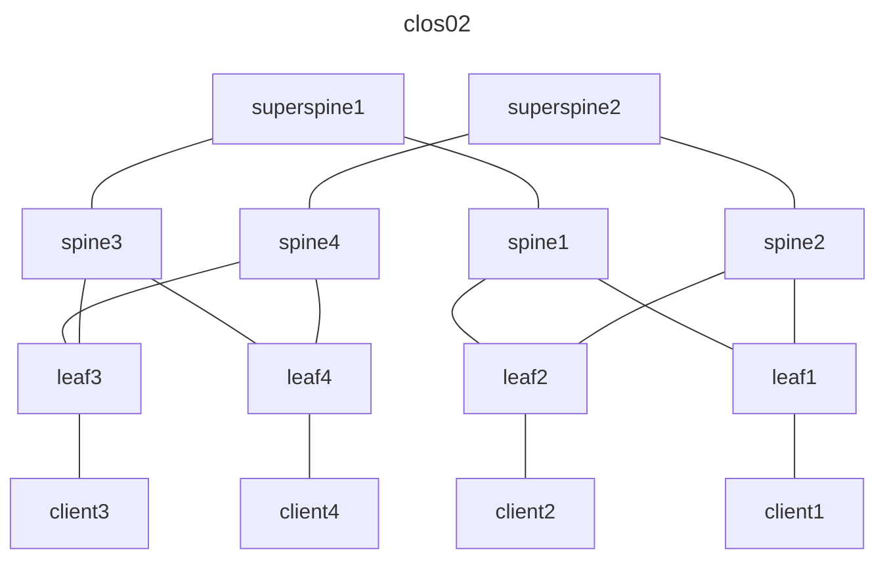

# Release 0.43

:material-calendar: 2023-07-26 · :material-list-status: [Full Changelog](https://github.com/srl-labs/containerlab/releases)

## MACVLAN interfaces

@steiler added support for [MACVLAN interfaces](../manual/network.md#macvlan-links) in #1402. This is a great addition for those who want to run containerlab and have the nodes to be directly connected to the physical network. Here is an example of a topology that uses MACVLAN interfaces:

```yaml
name: macvlan

topology:
  nodes:
    l1:
      kind: linux
      image: alpine:3

  links:
    - endpoints: ["l1:eth1", "macvlan:enp0s3"]
```

This results in `l1` node having a macvlan interface named `eth1` that uses a parent interface of `enp0s3`. The parent interface is the one that is connected to the physical network. The `enp0s3` interface is created on the host machine and is not visible to the container. The `eth1` interface is created inside the container and is visible to the container only. The `eth1` interface is assigned an IP address from the same subnet as the `enp0s3` interface. This allows the container to be directly connected to the physical network.

## Mermaid diagrams

@YutaroHayakawa in #1433 added a new graph function that allows you to generate Mermaid-based diagrams which you can embed into, for example, markdown documents on Github.

Check out the [documentation](../cmd/graph.md#mermaid_1) for more details.

Here is an example of embedding a mermaid graph diagram for the 5-tier Clos topology from the lab example. It was generated with the following command:

```bash
clab graph --mermaid -t /etc/containerlab/lab-examples/clos02/clos02.clab.yml 
```



Compare it with the [hand-drawn topology](../lab-examples/min-5clos.md#description) and you can see that it is pretty close to the real thing.

## Overwriting bind mounts

With #1446 users can now overwrite bind mounts that are defined on a more granular levels of a topology. A good example for such case is where a user defines some bind mounts for a certain kind, but then wants to overwrite some of these binds on a per-node basis. Here is an example:

```yaml
topology:
  kinds:
    linux:
      binds:
        - source1.json:/dst.json:ro
  nodes:
    linux1:
      kind: linux
      binds:
        - source2.json:/dst.json:ro
```

Here the `linux1` node will have `source2.json` mounted to `/dst.json` instead of `source1.json` that is defined on the kind level.

## Execute on host

With #1481 users can now execute commands on the host machine defined in the topology file. Typically this is used to prepare host environment for the lab in question.

Now by specifying the [`host`](../manual/kinds/host.md) node in the topology you can add `exec` section to it and this will tell containerlab to execute commands on the host machine.

## Miscellaneous

* when dynamic port bindings are used they are now printed in the `inspect -f json` and the `topology-data.json` file #1430
* users with authentication via AD can now properly enjoy containerlab's ability to use the home directory of the user that runs the command #1449
* kernel check has been fixed in #1460
