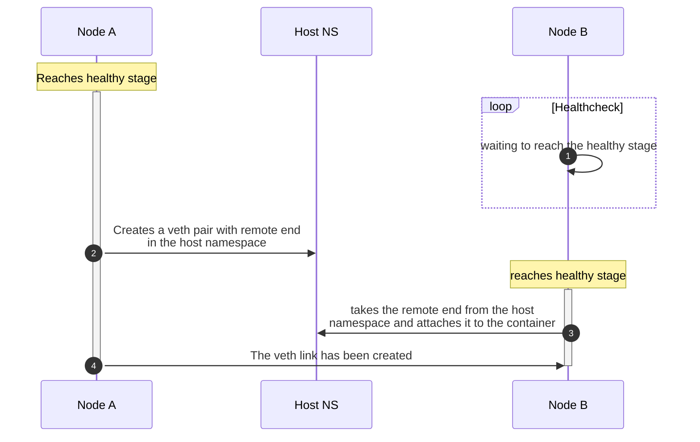

# Release 0.52

:material-calendar: 2024-03-05 · :material-list-status: [Full Changelog](https://github.com/srl-labs/containerlab/releases)

## Links and Stages

In #1914 @steiler made a big leap forward by unblocking links creation between the nodes. Previously a link could only be created between the nodes if both node-backing containers were running.

This interdependency between the links and nodes was a big blocker for the [stages](../manual/nodes.md#stages) feature, since you couldn't, say, make one node to wait on another if they had a link between them. Effectively this reduced the usefullness of the stages particularly for VM-based nodes.

Now, the links creation is handled on a per-node basis, which means that a node creates its side of the link as soon as it is ready, regardless of the state of the other node. The other node will pick its part of the link and attach it whenever it is ready.

This change makes it possible for `nodeA` to depend on `nodeB` using stages, even if they have a link between them. Here is how it works:

With links asynchronous creation, you can now define the stages for your nodes and make them wait on each other using the `wait-for` feature!

## Per-stage exec

With [Stages](../manual/nodes.md#stages) introduction in the previous release, we opened new possibilities for the nodes lifecycle management. Now, @steiler expanded it even further by adding the [per-stage exec](../manual/nodes.md#per-stage-command-execution) option to the stages.

--8<-- "docs/manual/nodes.md:per-stage-1"

## k8s-kind extra options

In #1912 @YutaroHayakawa added `kind` options to containerlab definition file to add extra extensibility to the way you can deploy kind clusters.

## Miscellaneous

* long-named links will use interface's AltName instead of Aliases #1908
* fixed doubled log messages for SR OS nodes #1919
