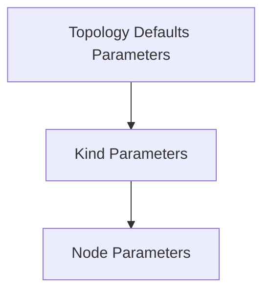

# Release 0.69

:material-calendar: 2025-07-18 · :material-list-status: [Full Changelog](https://github.com/srl-labs/containerlab/releases)

## Nokia SR-SIM

An exciting addition to our list of supported nodes is the [Nokia SR-SIM](../manual/kinds/sros.md) system that is identified with `nokia_srsim` in the topology file. This is an official native containerized version of the Nokia SR OS simulator, which allows you to run Nokia's SR OS in a container-based environment without the compromises of a VM-based simulator we used in the past.

That's right, the same feature set as in the VM-based simulator, but now in a native container. But there is more! The SR-SIM container supports a better way to run the distributed chassis, where each IOM and CPM is a standalone container for a nicer scheduling and workload distribution.

> And it runs on macOS and Windows too!

The team spent quite some time on the [docs](../manual/kinds/sros.md) and [examples](https://github.com/srl-labs/containerlab/tree/main/lab-examples/sr-sim) which we encourage you to check out!

/// note
You need a license to run the SR-SIM container.
///

Thanks to @sacckth @steiler @kaelemc and @vista- for their contributions!

## Juniper cJunosEvolved

More good news for Juniper users! The contribution from @kmo7 added support for the [`juniper_cjunosevolved`](../manual/kinds/cjunosevolved.md) kind, which is an official container package from Juniper that run a VM inside a container.

## VyOS

If you thought two new kinds in a single release was enough, hold your horses! @evilhamsterman added support for the [VyOS](../manual/kinds/vyosnetworks_vyos.md) containerized network operating system in #2630.

## Groups

If you have been with us for a while, you know that we have the following inheritance model in the topology file:

With Node parameters being the most specific and overriding the previous two. This is a decent model that served us well, but it had a limitation that you could not create parameters for an arbitrary group and then make a node inherit from it.

A practical use case for this to create separate groups for different roles of nodes, e.g. `core`, `leaf`, `spine`, etc. and then have the nodes inherit from these groups. This is possible now with the [`groups`](../manual/topo-def-file.md#groups) section in the topology file.

## Configuration save for VM nodes

The `save` command for VM-based kinds has been significantly improved in #2659 by @vista-. The `save` command will now copy the configuration out to the host filesystem and store it in the lab directory for most VM-based kinds running the following NOSes:

* Arista EOS
* Cisco IOS XE
* Cisco IOS XR
* Cisco NX-OS
* Juniper Junos and Junos EVO

## GoTTY

In the previous release we introduced SSHX feature to share a collaborative terminal session with others. While SSHX is awesome and claims to be secure, some users still prefer to self-host their terminal sharing solution. For those users, @FloSch62 added support for the [GoTTY](../manual/share-access.md#gotty) tool #2583. Nice!

## Nornir group support

Nornir inventory can now be generated with inventory groups. Thanks to @mpfz0r in #2593 for this contribution!

## Docker network driver options

With #2648 by @vista- merged, you can now specify docker network [bridge driver options](../manual/network.md#bridge-network-driver-options) to control the management network behavior.

## CSV for inspect

Is Excel your source of truth? No need to be shy. Make use of the [new output format](../cmd/inspect/index.md#format) of the inspect command that prints the data in the CSV format. #2651

## S3 URLs

Thanks to @hyposcaler-bot and their work in #2644 you can now [use S3 URLs](../manual/s3-usage-example.md) to refer to a topology file or a startup-config file.

## Miscellaneous

* podman pull-policy=always support #2577
* support for extended links format in json schema #2588
* fix for the health status report in the inspec #2594
* ssh config file is mounted to sshx pods #2634
* interface wait script improvements #2635
* fixed containerlab lab dir config to take precedence over the startup #2642
* `--cleanup` will remove the stale lab dir even if no containers for this lab are running #2631
* quickstart script to support AlmaLinux #2656
* creating bridges in the namespaces other than the host #2652
* added `mul`, `div`, and `rem` template functions #2658
* backup (.bak) files are now stored in the `/tmp/.clab/bak/` directory #2661
* support destroy operation by the name of the lab #2665
* when inspect is used with `--wide`, the table output will use a single line per node #2666
* quick setup script support for Fedora 42+ #2677
* destroying all labs with `--all` flag will now prompt a user for confirmation #2667
